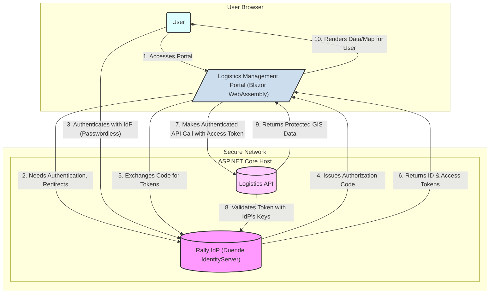

# Rally Logistics - Identity Provider (v1)

This repository contains the v1 implementation of the central Identity Provider (IdP) for the Rally Logistics platform, built with **Duende IdentityServer**.

## 1. Project Overview

The Rally Logistics Identity Provider (v1) was developed as the foundational security service for a suite of operational applications managing a global logistics network. The primary business objective for this initial version was to **rapidly deliver a secure, centralized authentication solution** to validate two core concepts:

1.  **Seamless Single Sign-On (SSO):** To provide a unified login experience for all personnel—including mobile drivers, dispatchers, and warehouse managers—across different applications like the Blazor-based "Logistics Management Portal" and future mobile clients.
2.  **Modern Passwordless Authentication:** To enhance security and user experience for the mobile driver workforce by implementing a robust, email-based one-time code login flow.

This project demonstrates the ability to leverage an industry-standard, feature-rich framework like **Duende IdentityServer** to quickly build and deploy an enterprise-grade OIDC provider. By handling user authentication, consent, and secure token issuance centrally, the IdP allows downstream applications (like the Logistics API and Management Portal) to focus on their core GIS and logistics functionalities.

**Key Responsibilities of this Service:**

-   **Centralized User Authentication:** Manages a single identity for each user.
-   **Passwordless Login Flow:** Implements a secure sign-in/sign-up process using one-time codes sent via email.
-   **OIDC/OAuth 2.0 Token Issuance:** Issues `id_token` and `access_token` JWTs to authenticated clients.
-   **Client & Resource Management:** Defines the trusted applications and API resources within the logistics ecosystem.

## 2. System Architecture (v1)

The v1 Rally Logistics platform is designed as a classic monolithic frontend with a backend-for-frontend (BFF) pattern, secured by a centralized Identity Provider. This architecture was chosen for its simplicity and rapid development speed, leveraging the power of the .NET ecosystem.

### High-Level Diagram

The diagram below illustrates the core components and the primary authentication flow:



### Component Roles

1.  **Rally IdP (Duende IdentityServer):**
    -   **Role:** The central authority on identity.
    -   **Function:** Manages all user sign-in and sign-up via its passwordless email flow. It issues JWT access tokens that grant permission to call the Logistics API. It runs as a self-contained service within the main ASP.NET Core host.

2.  **Logistics API:**
    -   **Role:** The protected resource server and data layer.
    -   **Function:** Exposes secure endpoints for accessing sensitive business data, such as vehicle locations, route plans, and cargo manifests. It validates every incoming access token to ensure the request is legitimate before returning data.

3.  **Logistics Management Portal (Blazor WebAssembly):**
    -   **Role:** The primary user interface.
    -   **Function:** A rich, interactive Single-Page Application (SPA) where dispatchers and managers visualize the fleet on a map, manage routes, and monitor logistics operations. It is responsible for initiating the OIDC login flow and using the acquired access token to fetch data from the Logistics API.

### Authentication Flow Explained

The system uses the **OIDC Authorization Code Flow with PKCE**.

-   When a user accesses the Blazor Portal, the application redirects them to the Rally IdP to log in.
-   After the user successfully authenticates using their one-time email code, the IdP sends them back to the Blazor Portal with an `authorization code`.
-   The Blazor application's backend component then securely exchanges this code for an `id_token` (proving who the user is) and an `access_token` (a key to access the API).
-   To display protected data like a vehicle's location, the Blazor Portal makes a request to the Logistics API, including the `access_token` in the `Authorization` header.
-   The Logistics API independently verifies the token's signature, issuer, and audience before granting access and returning the requested GIS data.

This architecture ensures a clean separation of concerns: the IdP handles *who* can log in, while the API handles *what* they can do.


## 3. Key Features

The v1 Identity Provider was built to deliver a specific set of enterprise-ready features, focusing on modern authentication patterns, security, and developer experience.

### Modern User Authentication

-   **Passwordless Login & Registration:** The primary authentication method is a secure and user-friendly passwordless flow. Users can sign in or register using only their email address and a one-time code, reducing password fatigue and enhancing security.
-   **Single Sign-On (SSO):** By centralizing authentication, the IdP enables a seamless SSO experience. Once a user is logged into the IdP, they can access any integrated application (like the Logistics Management Portal) without needing to log in again.
-   **User-Friendly Consent Screen:** A custom-styled consent page clearly informs users what permissions an application is requesting (e.g., "View your profile," "Access your email address"), empowering them to make informed decisions about their data.

### OIDC/OAuth 2.0 Core Functionality

-   **Authorization Code Flow with PKCE:** Implements the most secure OIDC flow for both server-side applications and public clients like SPAs, protecting against authorization code interception attacks.
-   **Standard-Compliant Discovery:** Provides a `/.well-known/openid-configuration` discovery document, allowing client applications and APIs to automatically configure themselves by fetching endpoint URLs, supported scopes, and token signing keys.
-   **Database-Driven Configuration:** All clients, API scopes, and identity resources are defined in code (`Configuration/Config.cs`) and seeded into the database, allowing for version-controlled, repeatable environment setups.
-   **Operational Data Persistence:** All grants, consents, and issued tokens are persisted to the database, enabling robust session management and auditing capabilities.

### Security & Hardening

-   **Persistent Signing Credentials:** The IdP uses a persistent X.509 certificate for signing JWTs, ensuring token validation keys remain stable across application restarts, which is a requirement for any production system.
-   **Hardened HTTP Security Headers:** Implements a strict Content Security Policy (CSP), X-Frame-Options, and other security headers via middleware to protect the IdP itself from common web vulnerabilities like clickjacking and cross-site scripting.
-   **Secure Data Protection Keys:** ASP.NET Core's data protection keys (used for securing anti-forgery tokens and other sensitive data) are persisted to the database, ensuring they are shared and trusted across all instances in a potential multi-server deployment.
-   **Account Lockout Mechanism:** Protects against brute-force attacks by temporarily locking user accounts after multiple failed login attempts.

### Observability & Operations

-   **Structured, Multi-Sink Logging:** Utilizes Serilog for robust, structured logging to both rolling files (for deep diagnostics) and the console.
-   **Real-Time Security Alerting:** Features a custom Serilog sink that pushes high-priority security events (e.g., login failures, account lockouts, fatal errors) to a Discord webhook, providing immediate visibility into potential security issues for the operations team.

## 4. Technology Stack

The v1 Identity Provider is built on a modern, robust, and widely-supported set of technologies from the .NET ecosystem, chosen to ensure reliability, security, and performance.

| Category                | Technology / Library                                           | Purpose                                                                                                                                                                                                                                                           |
| ----------------------- | -------------------------------------------------------------- | ----------------------------------------------------------------------------------------------------------------------------------------------------------------------------------------------------------------------------------------------------------------- |
| **Framework**           | **.NET  / ASP.NET Core**                                      | The core application framework, providing a high-performance, cross-platform runtime for web applications and services.                                                                                                                                               |
| **OIDC & OAuth 2.0**    | **Duende IdentityServer v7**                                   | A certified, feature-rich, and industry-standard framework for implementing an OpenID Connect Provider and Authorization Server. Chosen for its comprehensive feature set and robust security model.                                                                 |
| **User Management**     | **ASP.NET Core Identity**                                      | Manages core user lifecycle operations, including user storage, password hashing (if used), and the generation and validation of security tokens for flows like email confirmation and passwordless login.                                                               |
| **Database**            | **PostgreSQL**                                                 | A powerful, open-source object-relational database system used for all data persistence needs.                                                                                                                                                                    |
| **Data Access**         | **Entity Framework Core (EF Core)**                            | The primary Object-Relational Mapper (O/RM) used to interact with the PostgreSQL database. The project utilizes three distinct `DbContexts` as recommended by Duende IS: `ApplicationDbContext`, `ConfigurationDbContext`, and `PersistedGrantDbContext`.                |
| **Logging**             | **Serilog**                                                    | A flexible and powerful structured logging library. Configured with sinks for the Console, Rolling Files, and a custom sink for real-time **Discord** alerts for critical security events.                                                                             |
| **Security Headers**    | **NetEscapades.AspNetCore.SecurityHeaders**                    | A middleware library used to apply essential security headers (like Content-Security-Policy, X-Frame-Options, etc.) to all HTTP responses, hardening the application against common web attacks.                                                                          |
| **Email Service**       | **System.Net.Mail (via Gmail SMTP)**                           | Used for sending one-time codes for the passwordless login flow. This setup is intended for development and will be replaced by a production-grade service like **Amazon SES** or **SendGrid**.                                                                         |

## 5. Development Setup

This guide provides step-by-step instructions to get the Rally Logistics Identity Provider (v1) running on a local development machine.

### Prerequisites

-   **.NET SDK**
-   **PostgreSQL**  running locally or in a Docker container.
-   **Git** for cloning the repository.
### 1. Clone the Repository

```bash
git clone https://github.com/fady17/rally.git
cd Rally
```

### 2. Configure Local Secrets

This project uses the .NET Secret Manager tool to store sensitive configuration data during development, ensuring that secrets are not committed to source control.

First, initialize user secrets for the project if you haven't already:
```bash
dotnet user-secrets init
```

Next, set the required secrets using the following commands. Replace the placeholder values with your local configuration.

```bash
# --- Database Connection ---
# Replace YOUR_DB_PASSWORD with the password for your local PostgreSQL user.
dotnet user-secrets set "ConnectionStrings:DefaultConnection" "Host=localhost;Port=5432;Database=rally_db_dev;Username=rally_idp_user;Password=YOUR_DB_PASSWORD;Include Error Detail=true"

# --- Signing Certificate ---
# The PFX certificate used for signing tokens. See step 3 for how to generate this.
# Replace with the actual path and password you use.
dotnet user-secrets set "IdentityServer:SigningCertPath" "/path/to/your/rally-signing-cert.pfx"
dotnet user-secrets set "IdentityServer:SigningCertPassword" "YOUR_PFX_PASSWORD"

# --- Email Service (Gmail for Dev) ---
# Use a Gmail account and generate an "App Password" for this.
# https://support.google.com/accounts/answer/185833
dotnet user-secrets set "Smtp:Server" "smtp.gmail.com"
dotnet user-secrets set "Smtp:Port" "587"
dotnet user-secrets set "Smtp:SenderName" "Rally Logistics Dev"
dotnet user-secrets set "Smtp:SenderEmail" "YOUR_GMAIL_ADDRESS@gmail.com"
dotnet user-secrets set "Smtp:Username" "YOUR_GMAIL_ADDRESS@gmail.com"
dotnet user-secrets set "Smtp:Password" "YOUR_GMAIL_APP_PASSWORD"

# --- Discord Alerting (Optional) ---
# Create a webhook in your Discord server for real-time security alerts.
dotnet user-secrets set "Discord:WebhookUrl" "YOUR_DISCORD_WEBHOOK_URL"
```

### 3. Generate a Development Signing Certificate

Duende IdentityServer requires a persistent certificate for signing tokens. For local development, you can generate a self-signed PFX certificate.

```bash
# Run this command from within the project directory.
# Replace YOUR_PFX_PASSWORD with the same password you used in the user secrets.
dotnet dev-certs https --export-path ./rally-signing-cert.pfx --password YOUR_PFX_PASSWORD
```

Move the generated `rally-signing-cert.pfx` file to the secure path you configured in the `IdentityServer:SigningCertPath` secret (e.g., a `C:\secure` or `~/secure_certs` directory outside the git repository).

### 4. Set Up the Database

1.  **Create the Database User:** Ensure the PostgreSQL user (`rally_idp_user` in the example connection string) exists and has permissions to create databases and tables.
2.  **Create the Database:** Ensure the database (`rally_db_dev` in the example) exists.
3.  **Apply EF Core Migrations:** This project uses three separate `DbContexts`. Run the `database update` command for each one to create all necessary tables.

    ```bash
    # From the project root directory (Rally/)...
    
    # Creates ASP.NET Identity and Data Protection tables
    dotnet ef database update -c ApplicationDbContext

    # Creates Duende IS Client, Resource, and Scope tables
    dotnet ef database update -c ConfigurationDbContext

    # Creates Duende IS tables for grants, tokens, and other operational data
    dotnet ef database update -c PersistedGrantDbContext
    ```

### 5. Run the Application

You are now ready to run the Identity Provider.

```bash
dotnet run --launch-profile https
```

On the first run, the application will automatically seed the `ConfigurationDbContext` with the clients and resources defined in `Configuration/Config.cs`. The IdP will be available at the URL specified in `launchSettings.json` (e.g., `https://localhost:7223`). You can access the discovery document at `https://localhost:7223/.well-known/openid-configuration` to verify it is running correctly.


## 6. Security Posture

Security is the most critical aspect of an Identity Provider. This section outlines the security measures implemented in the v1 platform and provides a clear-eyed assessment of its current posture, distinguishing between development-time conveniences and production-ready requirements.

### Implemented Security Measures

-   **Persistent Signing Credentials:** The default in-memory developer signing credential has been replaced with a persistent, file-based X.509 certificate. This ensures that token-signing keys remain stable across application restarts, which is mandatory for validating tokens in a distributed system.
-   **Database-Persisted Data Protection Keys:** ASP.NET Core's data protection keys are stored in the database. This prevents a critical issue where keys stored in memory would be lost on restart, invalidating all existing authentication cookies and anti-forgery tokens. In a load-balanced scenario, this ensures all servers share the same keys.
-   **Secure Configuration Practices:** Sensitive configuration data (database connection strings, certificate passwords, email credentials) is explicitly kept out of source control and managed via the .NET Secret Manager tool for local development.
-   **Hardened HTTP Security Headers:** The application employs the `NetEscapades.AspNetCore.SecurityHeaders` middleware to set a strict Content Security Policy (CSP), `X-Frame-Options: DENY`, and other headers to mitigate common web vulnerabilities like clickjacking and XSS.
-   **Real-Time Security Alerting:** A custom Serilog sink provides immediate notifications to a Discord channel for high-priority security events, such as account lockouts and repeated login failures, enabling a rapid response to potential threats.

### Current Limitations & Path to Production

The v1 implementation is a robust proof-of-concept and is **not yet production-hardened**. The following items represent the critical path from the current development state to a production-ready deployment:

-   **Certificate Management:** The self-signed development certificate must be replaced with a certificate issued by a trusted Certificate Authority (CA) for production. This production certificate and its private key must be stored securely using a service like Azure Key Vault, AWS Secrets Manager, or the host machine's protected certificate store.
-   **Secret Management:** All secrets must be moved from .NET User Secrets to a production-grade secret management solution (e.g., environment variables in a secure hosting environment, or a dedicated vault service). Client secrets for OIDC clients should be managed through a secure administrative process, not defined in `Config.cs`.
-   **Content Security Policy (CSP) Refinement:** The current CSP includes `'unsafe-inline'` for scripts and styles as a development convenience. For production, this must be eliminated by implementing a stricter policy using hashes or nonces to prevent XSS vulnerabilities.
-   **Email Service:** The development email service (using Gmail via SMTP) has rate limits and is not suitable for production. It must be replaced with a scalable, transactional email service like **Amazon SES**, **SendGrid**, or **Mailgun**.
-   **Full Platform Hardening:** A comprehensive security review and hardening process must be completed, including configuring `UseHsts` and `UseForwardedHeaders` behind a reverse proxy, conducting a full dependency scan for vulnerabilities, and establishing formal processes for monitoring, auditing, and patching.
